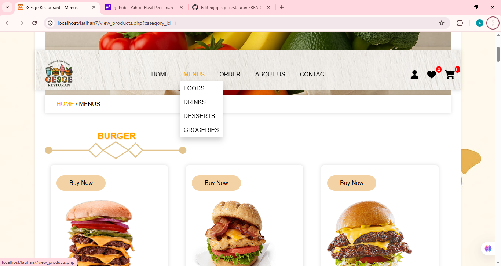

# 🍔 gesge-restaurant
A simple restaurant website built using HTML, CSS, JavaScript, and PHP. it features product categories, ordering functionality, and user authentication. Currently optimized for dekstop view only as media quaries for mobile responsivness are not yet implemented.

## 📌 Features
- Homepage with slider page
- Menu page categorized by type (Food, Drink, Dessert, Grocery)
- Order and View order
- User registration and login
- Wishlist and cart indicators
- About me and Contact form

## 🛠 Built With
- **HTML5**
- **CSS3**
- **JavaScript**
- **PHP**
- **MySQL** (via phpMyAdmin)
- **Font Awesome**

## 💻 Live Preview
Website is hosted via **InfintyFree**
🔗
[gesge-restaurant.rf.gd] (https://gesge-restaurant.rf.gd) *(Only accessible on dekstop view)*

> ⚠ This website is currently not responive for mobile devices. Media queries will be added in the future update.

## 🖼 Screenshots

### Homepage

### Homepage Slider

### Login

### Menupage

### Order

### Wishlist

