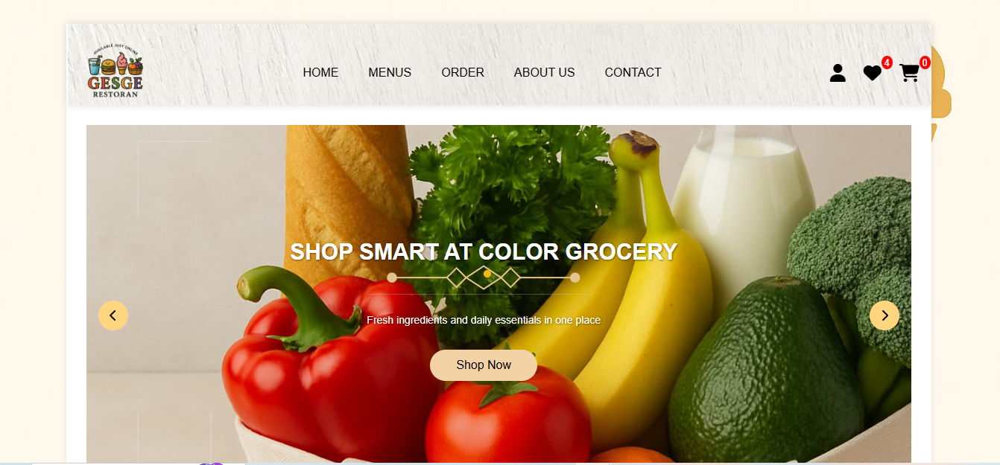
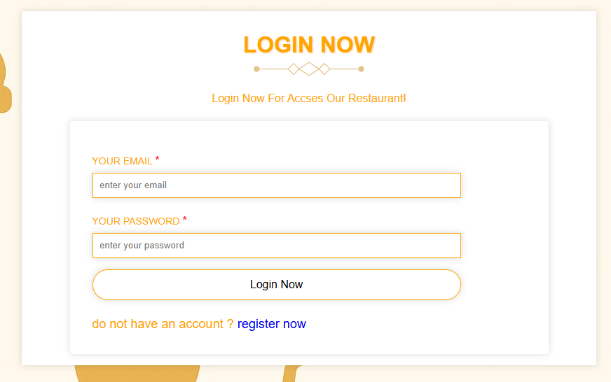
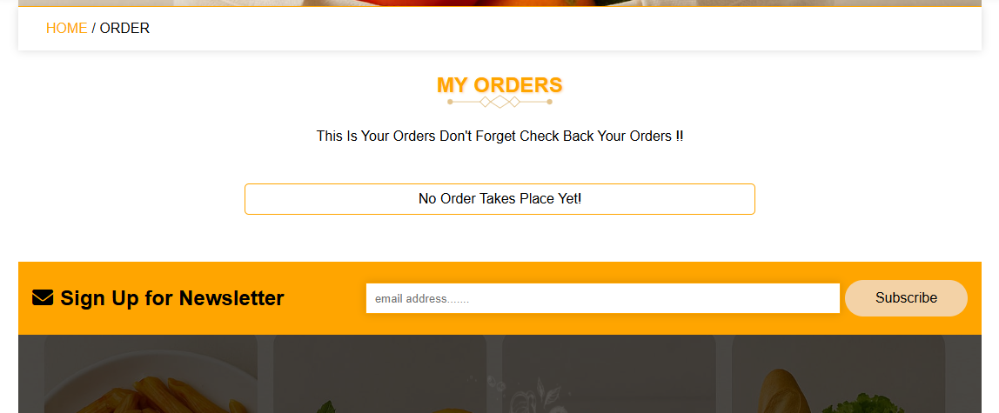
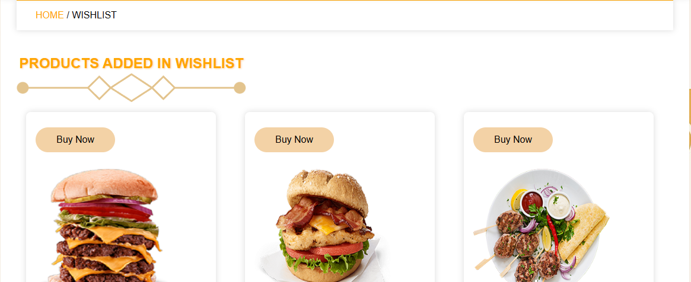

# 🍔 gesge-restaurant
A simple restaurant website built using HTML, CSS, JavaScript, and PHP. it features product categories, ordering functionality, and user authentication. Currently optimized for dekstop view only as media quaries for mobile responsivness are not yet implemented.

## 📌 Features
- Homepage with slider page
- Menu page categorized by type (Food, Drink, Dessert, Grocery)
- Order and View order
- User registration and login
- Wishlist and cart indicators
- About me and Contact form

## 🛠 Built With
- **HTML5**
- **CSS3**
- **JavaScript**
- **PHP**
- **MySQL** (via phpMyAdmin)
- **Font Awesome**

## 💻 Live Preview
Website is hosted via **InfintyFree**
🔗
[gesge-restaurant.rf.gd] (https://gesge-restaurant.rf.gd) *(Only accessible on dekstop view)*

> ⚠ This website is currently not responive for mobile devices. Media queries will be added in the future update.

## 🖼 Screenshots

### Homepage

### Homepage Slider

### Login

### Menupage

### Order

### Wishlist

## 🚀 Installation
# 1️⃣ Clone the repository
https://github.com/Gagasgees/gesge-restaurant.git

# 2️⃣ Import into the project directory
cd gesge-restaurant

# 3️⃣ Import the database
# Open phpMyAdmin or your tool database
# Make a new database (for example : gesge-restaurant)
# Import your file SQL there are in folder database

# 4️⃣ Update database configuration
# Edit file connection.php/config.php
# Make a local your canfiguration :
# $db_name = "mysql:host=localhost;dbname=gesge-restaurant";
# $db_user = "root";
# $db_pass = " ";

# 5️⃣ Run the app
# Run a local server, for example in XAMPP : https://localhost/gesge-restaurant/

## 🤝 Contributing
Pull requests are welcome. For major changes, please open an issue first to discuss what you would like to change.

## 🙎‍♂️ Author
Gagas
[Github] (https://github.com/gagasgees)
[LinkedIn] (https://www.linkedin.com/in/gagas-6b5368315?utm_source=share&utm_campaign=share_via&utm_content=profile&utm_medium=android_app)
